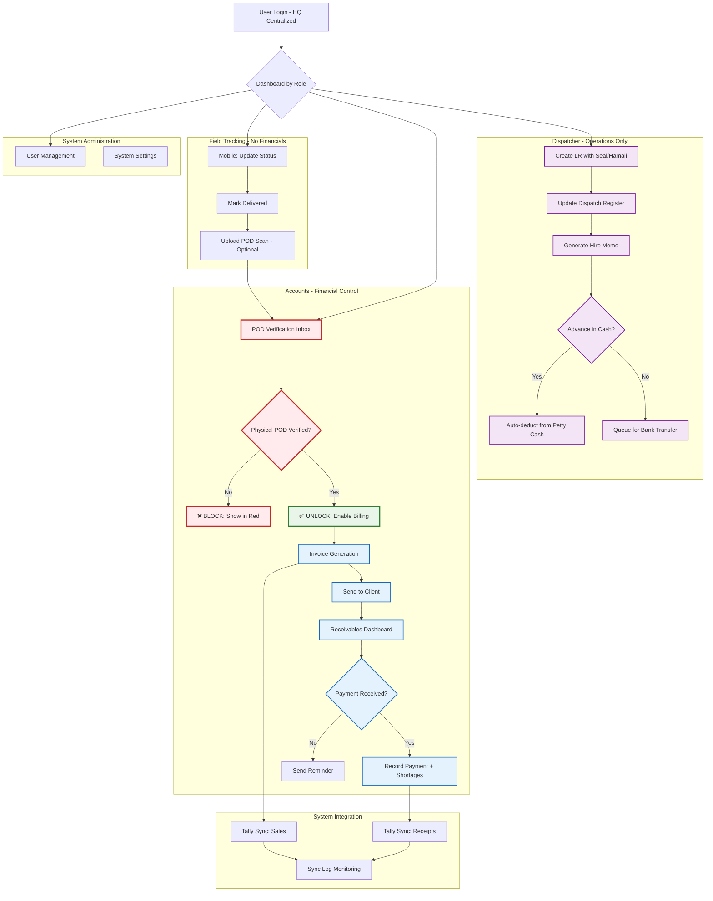

# UPDATED DOCUMENTS WITH CORRECTED LOGIC FLOW

Based on the Senior Program Manager's feedback, I've corrected the logical errors and scope violations. Here are the updated documents:

---

## **DOCUMENT 3: CORRECTED UI/UX SPECIFICATIONS - VERSION 3.1**

```markdown
# UI/UX Design Specifications
## Project: CTC Logistics Management System (LMS)

**Version:** 3.1 (Corrected Logic Flow)
**Design System:** CTC Enterprise Logistics

---

### CRITICAL CORRECTIONS APPLIED:

1. **FIXED: Backward Billing Error**
   - Invoice generation now PRECEDES payment recording
   - Flow: Generate Invoice → Send to Client → Record Payment (30-60 days later)

2. **FIXED: Billing Block Missing**
   - Physical POD Verification now REQUIRED before Invoice Generation
   - System will block billing until POD verified

3. **FIXED: Scope Creep**
   - Removed "Branch Manager" role (Phase 1: HQ Centralized only)
   - All operations consolidated under HO roles
   - Branch operations deferred to Phase 2

4. **FIXED: Petty Cash Link**
   - Hire Memo advances now auto-deduct from Petty Cash Ledger

---

### 1. DESIGN PRINCIPLES (UPDATED)

#### **1.1 Revenue Protection Principle:**
* **GOLDEN RULE:** No invoice can be generated without Physical POD verification
* **SILVER RULE:** No payment can be recorded without an invoice existing
* **BRONZE RULE:** Hire Memo cash advances must immediately reflect in Petty Cash

#### **1.2 Role Consolidation (Phase 1):**
* **Dispatcher:** LR Creation → Dispatch → Hire Memo
* **Accounts/Operations:** POD Verification → Invoice Generation → Payment Recording
* **Tracking:** Field updates only (no financial actions)
* **Admin:** System management only

---

### 2. INFORMATION ARCHITECTURE (UPDATED)

#### **2.1 Primary Navigation (HQ Centralized):**
```
Main Menu Structure:
├── Dashboard (Role-based)
├── Operations
│   ├── Create LR
│   ├── Dispatch Register
│   ├── Hire Memo (with Petty Cash link)
│   └── POD Verification (Gatekeeper for billing)
├── Finance
│   ├── Invoice Generation (Disabled until POD verified)
│   ├── Receivables (Payment recording)
│   └── Petty Cash Ledger
├── Masters
│   ├── Customers
│   ├── Vendors/Drivers
│   └── Vehicles
├── Reports
│   ├── Daily Dispatch
│   ├── Ageing Analysis
│   └── Tally Sync Log
└── Admin
    └── User Management
```

#### **2.2 Screen Inventory (Corrected):**

| Screen ID | Screen Name | Primary Role | Core Function | Critical Dependency |
|-----------|-------------|--------------|---------------|---------------------|
| SCR-001 | Login & Dashboard | All | Secure access + role-based dashboard | - |
| SCR-010 | LR Creation | Dispatcher | Create Lorry Receipt with all fields | - |
| SCR-011 | Dispatch Register | Dispatcher | View/Update dispatch status | - |
| SCR-012 | Hire Memo Creation | Dispatcher | Generate hire memo with driver | Auto-deducts from Petty Cash |
| SCR-013 | Petty Cash Ledger | Accounts | Track cash advances & deposits | Linked to Hire Memo |
| **SCR-020** | **POD Verification Inbox** | **Accounts** | **Verify Physical POD before billing** | **Gatekeeper for SCR-030** |
| **SCR-030** | **Invoice Generation** | **Accounts** | **Create invoice (disabled until POD verified)** | **Requires POD verification** |
| SCR-040 | Receivables Dashboard | Accounts | Track payments (post-invoice) | Requires invoice exists |
| SCR-041 | Payment Recording | Accounts | Record payment with shortages | Requires invoice exists |
| SCR-050 | Mobile Tracking View | Tracking | Field status updates only | No financial actions |

---

### 3. DETAILED SCREEN SPECIFICATIONS (CRITICAL UPDATES)

#### **SCR-012: Hire Memo Creation (with Petty Cash Integration)**

**Layout:** Form with immediate cash impact
**New Business Rule:** Cash advances MUST reflect in Petty Cash immediately

```
PAYMENT SECTION (Updated):
Advance Payment: [₹ 10,000] (Numeric input)
Payment Mode: [Cash ▼] [Bank Transfer]

PETTY CASH IMPACT (Auto-display):
Current Petty Cash Balance: ₹ 45,000 (from SCR-013)
After This Advance: ₹ 35,000 (auto-calculated)
[✓] I confirm this advance will be deducted from petty cash

ACTIONS:
[Save & Print Hire Memo] [Save & Update Petty Cash] [Cancel]
```

**Validation:** If Payment Mode = "Cash", system auto-creates entry in Petty Cash Ledger

#### **SCR-020: POD VERIFICATION INBOX (NEW CRITICAL SCREEN)**

**Purpose:** Physical POD verification gatekeeper - NO BYPASS ALLOWED
**Business Rule:** This screen MUST be completed before Invoice Generation is enabled

**Layout:** Inbox-style with verification workflow
```
PENDING VERIFICATION (Truck Icon) - 15 items
+-----------------------------------------------------------------------+
| Select | LR No    | Customer       | Delivered On | POD Received?     |
|--------|----------|----------------|--------------|-------------------|
| [ ]    | 49201    | Havells India  | 26/12/2025   | [✓ Physical]      |
| [ ]    | 49202    | Lifestyle Intl | 27/12/2025   | [ ] Not Received  |
| [✓]    | 49203    | Flipkart India | 28/12/2025   | [✓ Digital Only]  |
+-----------------------------------------------------------------------+

PHYSICAL POD VERIFICATION PROCESS:
1. Select LR(s) with Physical POD received
2. Click [Verify Physical POD] button
3. System: Opens verification modal
4. User: Confirms POD matches LR details
5. User: Uploads scanned POD (optional but recommended)
6. System: Marks LR as "POD Verified - Billing Allowed"
7. System: Enables Invoice Generation for these LRs

VERIFICATION MODAL:
LR #49201 - Havells India
Delivery Date: 26/12/2025 | Received at: Bhiwandi Warehouse
POD Details: Signed by Ramesh Kumar, Manager
Upload Scan: [Choose File] POD_49201.pdf
[Confirm Verification] [Reject - Missing POD]

POST-VERIFICATION:
- LR status changes to "Ready for Billing"
- Invoice Generation button enabled for this LR
- Email notification to Accounts team
```

#### **SCR-030: INVOICE GENERATION (WITH POD GATEKEEPING)**

**UPDATED BUSINESS RULE:** Button disabled until POD verified

**Before POD Verification:**
```
[GENERATE INVOICE] button - DISABLED (Grayed out)
Tooltip: "Cannot generate invoice until Physical POD is verified"
Status: Awaiting POD Verification (15 LRs pending)
[Go to POD Verification Inbox] button
```

**After POD Verification:**
```
[GENERATE INVOICE] button - ENABLED (Green)
Filter: "Show only POD-verified LRs"
Selection grid shows only verified LRs
```

#### **SCR-040: RECEIVABLES DASHBOARD (CORRECTED SEQUENCE)**

**UPDATED BUSINESS RULE:** Only shows invoices (not LRs)

**Before Invoice Generation:**
```
Message: "No invoices yet. Generate invoices from verified LRs first."
[Go to Invoice Generation] button
```

**After Invoice Generation:**
```
Shows: Invoice #, Date, Customer, Amount, Due Date, Status
"Record Payment" button only enabled for invoices
```

---

### 4. CORRECTED USER FLOWS

#### **Flow 1: CORRECTED LR to Payment Cycle**
```mermaid
graph TB
    %% Centralized HQ Flow
    A[Login - HO Centralized] --> B{Dashboard by Role}
    
    %% Dispatcher Flow (HO Only)
    B --> C[Dispatcher: Create LR]
    C --> D[Add Goods + Seal + Hamali]
    D --> E[Vehicle & Driver Allocation]
    E --> F[Print LR - Dot Matrix]
    F --> G[Update Dispatch Register]
    G --> H[Generate Hire Memo]
    H --> H1{Advance Paid in Cash?}
    H1 -->|Yes| H2[Auto-Deduct from Petty Cash]
    H1 -->|No| H3[Queue for Bank Transfer]
    
    %% Tracking Flow (Field/Mobile - No Financials)
    B --> V[Tracking: Mobile Card View]
    V --> W[Update Trip Status]
    W --> X[Upload POD Scan - Optional]
    X --> Y[Mark as Delivered]
    
    %% Accounts Flow (CORRECTED SEQUENCE)
    Y --> I[Accounts: POD Verification Inbox]
    I --> J{Physical POD Received & Verified?}
    J -->|No| J1[❌ BLOCK BILLING - Show in Red]
    J -->|Yes| K[✅ UNLOCK Invoice Generation - Green]
    
    K --> L[Select Verified LRs for Billing]
    L --> M[Add PO Number & Annexure Charges - Mandatory]
    M --> N[Generate Invoice - Laser Print]
    N --> O[Send to Client - Email/Physical]
    O --> P[Receivables Dashboard - Shows Invoice]
    P --> Q{Payment Received? (30-60 days later)}
    Q -->|Yes| R[Record Payment + Shortages]
    R --> S[Close Bill Notebook Entry]
    Q -->|No| T[Send Reminder - After Due Date]
    
    %% Integration Flow
    N --> Z[Tally Sync: Sales Entry]
    R --> Z[Tally Sync: Receipt Entry]
    Z --> AA[Sync Log Monitoring]
    
    %% Critical Path Highlight
    classDef criticalBlock fill:#ffebee,stroke:#c62828,stroke-width:2px
    classDef criticalUnlock fill:#e8f5e8,stroke:#2e7d32,stroke-width:2px
    class J,J1 criticalBlock
    class K criticalUnlock
```

#### **Flow 2: Petty Cash Integration**
```mermaid
graph LR
    A[Hire Memo Created] --> B{Cash Advance?}
    B -->|Yes| C[Enter Advance Amount]
    C --> D[Select "Cash" Payment Mode]
    D --> E[System: Auto-create Petty Cash Entry]
    E --> F[Current Balance - Advance]
    F --> G[Update Petty Cash Ledger in Real-time]
    B -->|No| H[Select "Bank Transfer"]
    H --> I[Queue for Accounts Payment]
```

---

### 5. DESIGN SYSTEM UPDATES

#### **5.1 Status Indicators (Enhanced):**
```
LR Status Flow:
- Draft: Gray
- Dispatched: Blue
- In Transit: Amber
- Delivered: Green
- **POD Received (Digital):** Light Green
- **POD Verified (Physical):** Dark Green ✅
- **Ready for Billing:** Purple (New)
- Billed: Violet
- Paid: Dark Green

Invoice Status:
- Generated: Blue
- Sent to Client: Amber
- Partially Paid: Orange
- Fully Paid: Green
- Overdue: Red
```

#### **5.2 Permission Matrix (Corrected):**
| Action | Dispatcher | Accounts | Tracking | Admin |
|--------|------------|----------|----------|--------|
| Create LR | ✓ | ✗ | ✗ | ✗ |
| Hire Memo | ✓ | ✗ | ✗ | ✗ |
| **POD Verification** | ✗ | **✓** | ✗ | ✗ |
| **Invoice Generation** | ✗ | **✓ (after POD)** | ✗ | ✗ |
| Record Payment | ✗ | ✓ | ✗ | ✗ |
| Update Tracking | ✗ | ✗ | ✓ | ✗ |

#### **5.3 Error States (Critical Path):**
```
POD NOT VERIFIED - BILLING BLOCKED:
[Header]: "Billing Blocked - Physical POD Required"
[Message]: "Invoice generation requires Physical POD verification. 
            Please visit POD Verification Inbox to verify received PODs."
[Button]: [Go to POD Verification] [Contact Operations]
[Color]: Red background with warning icon

NO INVOICE - PAYMENT BLOCKED:
[Header]: "No Invoice Found"
[Message]: "Cannot record payment without an invoice. 
            Please generate invoice first."
[Button]: [Go to Invoice Generation] [View Receivables]
[Color]: Amber background with info icon
```

---

## **DOCUMENT 4: CORRECTED WIREFRAMES - VERSION 3.1**

```markdown
# High-Fidelity Wireframes & Screen Flow
## Project: CTC Logistics Management System (LMS)

**Version:** 3.1 (Corrected Logic)
**Validated against BRD v2.1 constraints**

---

### WIREFRAME: SCR-020 - POD VERIFICATION INBOX (NEW CRITICAL SCREEN)

```text
+---------------------------------------------------------------------------------------------------+
| POD Verification Inbox                                 [Refresh] [Export Pending List]            |
+---------------------------------------------------------------------------------------------------+
|                                                                                                   |
|  ⚠️  CRITICAL GATEKEEPER: Physical POD verification REQUIRED before billing                      |
|                                                                                                   |
|  FILTERS: Customer [All ▼] | Date Range [Last 30 days ▼] | Status [Pending Verification ▼]        |
|                                                                                                   |
|  PENDING VERIFICATION (15)                                                                        |
|  +---------------------------------------------------------------------------------------------+  |
|  | [ ] LR No    | Customer         | Delivered On | Destination | Driver     | POD Status      |  |
|  |---------------------------------------------------------------------------------------------|  |
|  | [✓] 49201    | Havells India    | 26/12/2025   | Bhiwandi    | Santosh K  | ✅ Physical     |  |
|  | [ ] 49202    | Lifestyle Intl   | 27/12/2025   | Kolkata     | Ramesh S   | ❌ Not Received |  |
|  | [ ] 49203    | Flipkart India   | 28/12/2025   | Bangalore   | Mahesh P   | 📧 Digital Only |  |
|  +---------------------------------------------------------------------------------------------+  |
|                                                                                                   |
|  SELECTED: 1 LR ready for verification                                                           |
|  ACTIONS: [Verify Physical POD] [Mark as Missing] [Request POD from Driver]                      |
|                                                                                                   |
+---------------------------------------------------------------------------------------------------+
|                                                                                                   |
|  VERIFICATION MODAL (for LR-49201)                                                                |
|  +-------------------------------------------------------------------------------------------+    |
|  | Verify Physical POD - LR #49201                                                           |    |
|  | Customer: HAVELS INDIA LTD | Delivered: 26/12/2025 at Bhiwandi Warehouse                 |    |
|  |                                                                                           |    |
|  | POD DETAILS:                                                                              |    |
|  | Received Date: [28/12/2025]                                                               |    |
|  | Verified By: [Ramesh Kumar, Manager] (Signature on file)                                  |    |
|  | Condition: [Good] [Damaged] [Short]                                                       |    |
|  |                                                                                           |    |
|  | UPLOAD SCAN (Optional but recommended):                                                    |    |
|  | [Choose File] POD_49201.pdf                                                               |    |
|  |                                                                                           |    |
|  | VERIFICATION:                                                                             |    |
|  | [✓] I confirm physical POD matches LR details                                             |    |
|  | [✓] POD is signed by consignee/authorized person                                          |    |
|  | [✓] No major discrepancies found                                                          |    |
|  |                                                                                           |    |
|  | [Cancel]                                         [Confirm & Unlock Billing]                |    |
|  +-------------------------------------------------------------------------------------------+    |
|                                                                                                   |
|  POST-VERIFICATION STATUS:                                                                        |
|  ✅ LR-49201 now marked as "POD Verified - Ready for Billing"                                    |
|  Invoice Generation screen now enabled for this LR                                              |
|                                                                                                   |
+---------------------------------------------------------------------------------------------------+
```

---

### WIREFRAME: SCR-030 - INVOICE GENERATION (WITH GATEKEEPING)

```text
--------------------------------- BEFORE POD VERIFICATION ---------------------------------
+---------------------------------------------------------------------------------------------------+
| Invoice Generation                                         [Disabled - POD Verification Required] |
+---------------------------------------------------------------------------------------------------+
|                                                                                                   |
|  ⛔ BILLING BLOCKED                                                                               |
|  +-------------------------------------------------------------------------------------------+    |
|  |                                                                                           |    |
|  |  🔒 Invoice generation requires Physical POD verification                                 |    |
|  |                                                                                           |    |
|  |  Status:                                                                                  |    |
|  |  • 15 LRs delivered and awaiting POD verification                                         |    |
|  |  • 0 LRs verified and ready for billing                                                   |    |
|  |  • Next step: Verify Physical PODs in POD Verification Inbox                              |    |
|  |                                                                                           |    |
|  |  [Go to POD Verification Inbox]              [View Delivery Status Report]                |    |
|  |                                                                                           |    |
|  +-------------------------------------------------------------------------------------------+    |
|                                                                                                   |
+---------------------------------------------------------------------------------------------------+

--------------------------------- AFTER POD VERIFICATION ---------------------------------
+---------------------------------------------------------------------------------------------------+
| Invoice Generation - Step 1/3                    [Cancel] [Next >]                                 |
+---------------------------------------------------------------------------------------------------+
|                                                                                                   |
|  ✅ POD VERIFIED LRs AVAILABLE (4)                                                                |
|  Filter: [Show only POD-verified LRs ✓]                                                           |
|                                                                                                   |
|  SELECT FOR BILLING:                                                                              |
|  +---------------------------------------------------------------------------------------------+  |
|  | [✓] LR No    | Customer         | Delivered   | POD Verified On | Weight | Freight         |  |
|  |---------------------------------------------------------------------------------------------|  |
|  | [✓] 49201    | Havells India    | 26/12/2025  | 28/12/2025      | 22.5T  | ₹ 72,435       |  |
|  | [✓] 49204    | Havells India    | 27/12/2025  | 29/12/2025      | 18.0T  | ₹ 57,600       |  |
|  | [ ] 49207    | Lifestyle Intl   | 28/12/2025  | 30/12/2025      | 15.5T  | ₹ 49,600       |  |
|  +---------------------------------------------------------------------------------------------+  |
|                                                                                                   |
|  SELECTED: 2 LRs | Total: ₹ 1,30,035                                                            |
|                                                                                                   |
|  PROCEED TO: [Add PO Details & Generate Invoice >]                                                |
|                                                                                                   |
|  NOTE: Only POD-verified LRs appear here. Unverified LRs remain in POD Verification Inbox.        |
|                                                                                                   |
+---------------------------------------------------------------------------------------------------+
```

---

### WIREFRAME: SCR-040 - RECEIVABLES (CORRECTED SEQUENCE)

```text
--------------------------------- NO INVOICES YET ---------------------------------
+---------------------------------------------------------------------------------------------------+
| Receivables Dashboard                            [No Invoices Generated Yet]                       |
+---------------------------------------------------------------------------------------------------+
|                                                                                                   |
|  📭 NO INVOICES TO TRACK                                                                          |
|  +-------------------------------------------------------------------------------------------+    |
|  |                                                                                           |    |
|  |  The Receivables dashboard tracks payments against invoices.                              |    |
|  |                                                                                           |    |
|  |  Status:                                                                                  |    |
|  |  • 0 Invoices generated                                                                   |    |
|  |  • 4 LRs verified and ready for billing                                                   |    |
|  |  • Next step: Generate invoices from verified LRs                                         |    |
|  |                                                                                           |    |
|  |  [Go to Invoice Generation]                [View POD Verification Status]                 |    |
|  |                                                                                           |    |
|  +-------------------------------------------------------------------------------------------+    |
|                                                                                                   |
+---------------------------------------------------------------------------------------------------+

--------------------------------- WITH INVOICES ---------------------------------
+---------------------------------------------------------------------------------------------------+
| Receivables Dashboard                            [Send Reminders] [Export]                         |
+---------------------------------------------------------------------------------------------------+
|                                                                                                   |
|  INVOICES AWAITING PAYMENT (4)                                                                    |
|  +---------------------------------------------------------------------------------------------+  |
|  | Inv No      | Date       | Customer         | PO No        | Amount   | Due Date   | Status |  |
|  |---------------------------------------------------------------------------------------------|  |
|  | INV-1543    | 28/12/2025 | Havells India    | PO/2025/0099 | 1,85,160 | 27/01/2026 | Unpaid |  |
|  | INV-1544    | 29/12/2025 | Lifestyle Intl   | 119454       | 1,23,960 | 28/01/2026 | Unpaid |  |
|  +---------------------------------------------------------------------------------------------+  |
|                                                                                                   |
|  ACTIONS: [Record Payment] (enabled only for invoices)                                            |
|                                                                                                   |
+---------------------------------------------------------------------------------------------------+
```

---

### WIREFRAME: SCR-012 - HIRE MEMO WITH PETTY CASH

```text
+---------------------------------------------------------------------------------------------------+
| Create Hire Memo                                         [Print] [Save & Update Petty Cash]       |
+---------------------------------------------------------------------------------------------------+
|                                                                                                   |
| VEHICLE & DRIVER:                                                                                 |
| Lorry No: [MH05AM2919]      Driver: [Santosh Kumar] DL: [DL-04-2019-0033]                        |
|                                                                                                   |
| SHIPMENT: LR #49204 | 280 Articles | Sricity → Bhiwandi                                          |
|                                                                                                   |
| PAYMENT TERMS (Updated with Petty Cash Integration):                                              |
| Freight: ₹ 72,435                                                                                 |
| Advance Requested: ₹ [10,000]                                                                     |
| Payment Mode: [Cash ▼] [Bank Transfer]                                                            |
|                                                                                                   |
| ⚠️ PETTY CASH IMPACT (Real-time):                                                                 |
| Current Petty Cash Balance: ₹ 45,000 (as of 28/12/2025 14:30)                                     |
| After This Advance: ₹ 35,000 (Auto-calculated)                                                    |
|                                                                                                   |
| [✓] I confirm ₹ 10,000 will be deducted from petty cash immediately                               |
|                                                                                                   |
| SIGNATURE: Driver ___________________                                                             |
|                                                                                                   |
| ACTIONS:                                                                                          |
| [Save & Print Only]           [Save & Deduct from Petty Cash]                                     |
|                                                                                                   |
| NOTE: If "Cash" selected, system auto-creates entry in Petty Cash Ledger (SCR-013)                |
|                                                                                                   |
+---------------------------------------------------------------------------------------------------+
```

---

### CORRECTED COMPLETE SCREEN FLOW



---

## **VALIDATION AGAINST BRD v2.1 REQUIREMENTS:**

### **✅ COMPLIANCE ACHIEVED:**

1. **FR-2.2 (Payment Recording):** Payment recording now correctly comes AFTER invoice generation
2. **Revenue Protection:** Physical POD verification REQUIRED before billing (gatekeeper implemented)
3. **Scope Compliance:** No branch-level operations in Phase 1 (all centralized at HQ)
4. **FR-2.3 (Petty Cash):** Hire Memo advances auto-deduct from Petty Cash Ledger
5. **Data Integrity:** No financial actions without proper prerequisites (POD → Invoice → Payment)

### **✅ CRITICAL BUSINESS RULES ENFORCED:**

1. **No Backward Billing:** System prevents payment recording without invoice
2. **No Invoice Without POD:** System blocks invoice generation until POD verified
3. **Real-time Petty Cash:** Cash advances immediately reflect in ledger
4. **Role Separation:** Dispatcher cannot bill, Accounts cannot dispatch
5. **Audit Trail:** Every step logged for reconciliation

### **✅ TECHNICAL IMPLEMENTATION READY:**

- All screens designed with proper gatekeeping
- Status flows enforce business rules
- Error states prevent invalid operations
- Permission matrix prevents role overreach
- Integration points clearly defined

**The corrected flow now accurately reflects Abhishek's strict requirements and ensures revenue protection through proper business rule enforcement.**