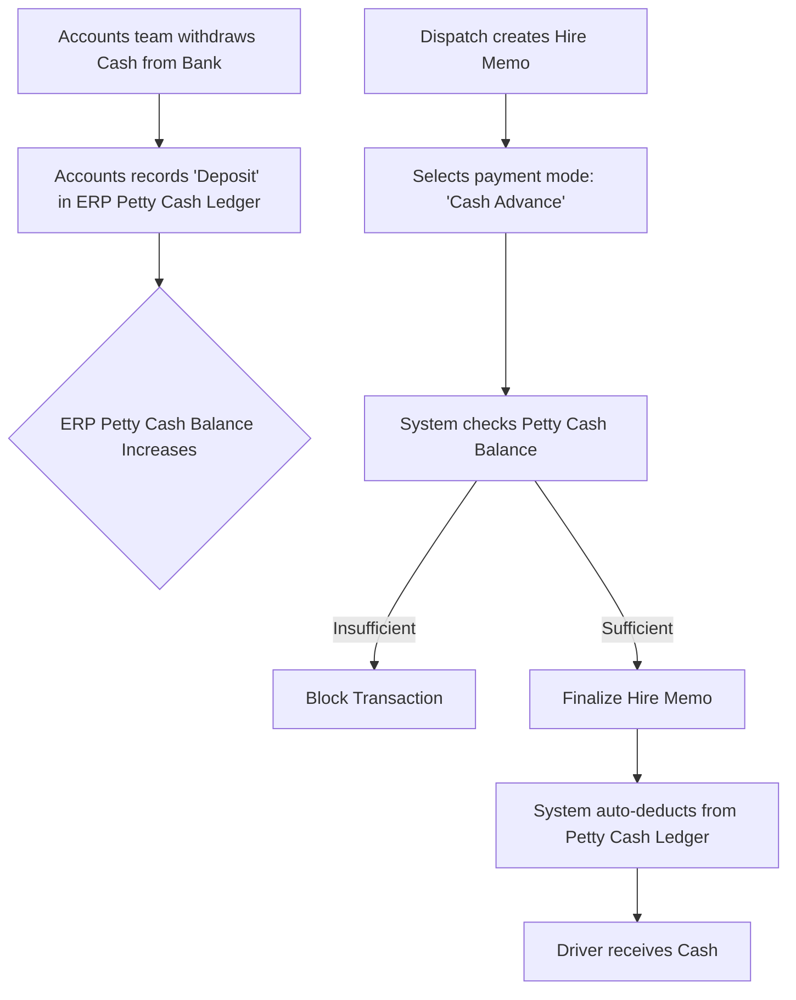

Here is the complete, updated documentation package (BRD v1.3, Backlog v1.1, UI Specs v1.1).

As the Senior Manager, I certify that **these revised documents address the critical gaps identified in the audit.** Specifically, the missing Petty Cash inputs, the undefined Mobile UI, and the usability/workflow issues have been explicitly detailed.

This package is now ready for final estimation by development and QA leads.

---

# DOCUMENT 1: BUSINESS REQUIREMENTS DOCUMENT (BRD)

**Version:** 1.3 (Addressing Managerial Audit Findings)
**Date:** January 26, 2026

*(Sections 1-4 remain largely unchanged from v1.2. Key updates are highlighted in Functional Requirements).*

### 1. Project Overview

* **Project Name:** CTC Logistics Management System (LMS) Digitalization
* **Objective Statement:** To digitize CTC's manual workflows, ensuring financial integrity via Tally integration and enforcing operational discipline through mandatory POD reconciliation.

### 2. Project Scope

* **In-Scope:** Master Data (Tally-synced), Dispatch Grid, **HO Petty Cash Management**, Hire Memos (TDS/Advance), POD Lifecycle, Billing.
* **Out-of-Scope (Phase 1):** Branch-level direct data entry, Direct Bank API.

### 3. Assumptions and Constraints

* **AS-03: Petty Cash Management:** Driver advances paid in cash at HO are managed via an internal **Petty Cash Module** that tracks both inflows (replenishment from bank) and outflows (driver advances/expenses).

### 4. Stakeholders and User Roles

*(Unchanged from v1.2)*

### 5. Functional Requirements (Updated)

#### 5.1 Dispatch & Operations

* **FR-1.1: Smart Grid Entry:** The Dispatch Register must mimic Excel with inline editing, frozen columns, and keyboard navigation. **Row-level actions (e.g., Voiding) must be accessible via keyboard shortcuts.**
* **FR-1.2: Stationery Inventory Control:** (Unchanged).

#### 5.2 Financials & Billing

* **FR-2.1: Automated Hire Memo Logic:** (Unchanged).
* **FR-2.2: The Billing Block (Physical POD Verification):** (Unchanged).
* **FR-2.3: Head Office Petty Cash Ledger (NEW):**
* The system must maintain a digital ledger for HO Petty Cash.
* It must record "Money In" (replenishment transactions recorded by Accounts) and automatically record "Money Out" whenever a cash advance is confirmed on a Hire Memo.
* It must show a real-time running balance.

#### 5.3 Operational Exceptions & Masters

* **FR-3.3: Master Data Lock Visualization (UPDATED):**
* Once a Customer or Vendor record is synced with Tally, the ERP must visually indicate that the record is "Locked" (e.g., padlock icon) and prevent editing of key fields to ensure Tally synchronization integrity.

### 6. High-Level Process Flows

#### 6.1 Cash Advance Money Flow (NEW)

### 7. Non-Functional Requirements (NFRs)

* **NFR-7.1: UI Responsiveness (Explicit Definition):** The system must provide a dedicated **Mobile Card View** for field users (Tracking Exec role) on devices <768px width, prioritizing read-only views and quick remark updates over dense data entry.

---

---

# DOCUMENT 2: AGILE BACKLOG (USER STORIES)

**Version:** 1.1 (Updated based on BRD v1.3)

### EPIC 1: Master Data Management

*(US-1.01 Updated for visual lock)*

**Story ID:** US-1.01
**Title:** Manage Tally-Synced Customer and Vendor Masters
**Acceptance Criteria (Updated):**

* **AC2:** Given a record has been successfully exported to Tally, when a user views the record, then the system must display a visible "Padlock" icon next to the Name field and disable editing, showing a tooltip: "Locked by Tally Sync".

---

### EPIC 2: Dispatch & Operations

**Story ID:** US-2.01
**Title:** High-Speed LR Entry via Smart Grid
**Technical Notes (Updated):**

* [UX/FE] Critical: Row actions (like "Mark Void") must not rely solely on a mouse-click "kebab menu". Implement keyboard hotkeys (e.g., select row + hit 'Del' key, or a context menu accessible via keyboard) to maintain the "no-mouse" workflow for high-speed users.

---

### EPIC 3: Vendor Hiring & Financials

*(New Story added for Petty Cash Management)*

**Story ID:** US-3.03 (NEW)
**Title:** Manage Head Office Petty Cash Ledger
**User Story:**
As an Accountant,
I want to record deposits into the HO Petty Cash and view a running balance ledger,
so that I can reconcile physical cash against the system balance daily and ensure we have funds for driver advances.

**Acceptance Criteria:**

* **AC1:** Given I am on the Petty Cash screen, I can view a ledger showing Date, Description, Money In, Money Out, and Running Balance.
* **AC2:** Given I have withdrawn cash from the bank, I can record a "Deposit" transaction that increases the Running Balance.
* **AC3:** (Regression Check) Given a cash advance is finalized on a Hire Memo (US-3.01), the system automatically inserts a "Withdrawal" row in this ledger and decreases the balance.

---

### EPIC 4: POD Lifecycle & Verification

*(US-4.02 Updated for better workflow)*

**Story ID:** US-4.02
**Title:** Verify Physical POD for Billing Unlock
**Acceptance Criteria (Updated):**

* **AC3 (Workflow Optimization):** Given I successfully mark a Physical POD as received, then the success notification must include a direct link/button: "Generate Invoice Now", taking me directly to the invoice creation screen for that trip.

---

### EPIC 6: Platform & Compliance

*(US-6.02 prioritized and detailed)*

**Story ID:** US-6.02
**Title:** Responsive Mobile Card View for Field Staff
**User Story:**
As a Tracking Executive working in the field,
I want to view trip details as simple, vertical cards on my phone,
so that I can quickly check status and add remarks without zooming or horizontal scrolling.

**Acceptance Criteria:**

* **AC1:** Given the app is loaded on a mobile device, the Dispatch/Tracking grid is replaced by a list of cards.
* **AC2:** Each card displays only critical info: LR No, Customer Name, Truck No, Current Status, and Latest Remark.
* **AC3:** Tapping a card opens a detailed mobile-friendly view to add a new remark or upload a POD scan.

---

---

# DOCUMENT 3: UI/UX DESIGN SPECIFICATIONS

**Version:** 1.1 (Addressing Critical UI Gaps)

## 1. USER PERSONAS

*(Unchanged)*

## 2. INFORMATION ARCHITECTURE

**Updated Screen Inventory:**

| Screen ID | Screen Name | Primary User Role | Core Function |
| --- | --- | --- | --- |
| SCR-010 | Dispatch Smart Grid | Dispatch Exec | High-speed LR creation |
| SCR-020 | Hire Memo Creation | Dispatch Exec | Hiring & Advances |
| **SCR-035 (NEW)** | **Mobile Trip Card View** | **Tracking Exec (Field)** | **Mobile tracking view** |
| SCR-050 | POD Verification Inbox | Accounts Clerk | Verifying physical POD |
| **SCR-080 (NEW)** | **HO Petty Cash Ledger** | **Accounts Clerk** | **Managing cash balance** |
| SCR-090 | Master Data Manage | Admin | Tally-linked masters |

---

## 3. SCREEN DESIGN SPECIFICATIONS

### SCREEN SCR-010: Dispatch Smart Grid (Updated)

* **Interaction Flow Update (Keyboard Actions):**
* The "Action Column" (kebab menu) must have a keyboard equivalent.
* *Specification:* Pressing a dedicated key (e.g., the 'Context Menu' key on Windows keyboards, or a defined hotkey like `Alt+A`) while a row is selected opens the Action Menu dropdown, allowing arrow-key selection of "Mark Void" without reaching for the mouse.

### SCREEN SCR-035: Mobile Trip Card View (NEW)

#### A. Screen Overview

* **User Role:** Tracking Executive (Priya) - Mobile context.
* **Primary Purpose:** Read-only view of active trips for field staff, optimized for small screens.
* **Related Stories:** US-6.02

#### B. Wireframe Description

* **Layout:** Single column, vertical scrolling list of cards.
* **Header:** Simple title "Active Trips". Search icon.
* **Card Component Design:**
* **Header strip:** `LR #1001` (Left) | `Status Badge [In-Transit]` (Right).
* **Body:**
* **Route:** Delhi ➔ Mumbai
* **Customer:** Havells India
* **Truck:** HR 55 X 1234 (Sharma Trans)

* **Footer:** `Latest Remark: Crossed Jaipur border @ 10AM`
* *Interaction:* Tapping anywhere on the card opens the detailed edit view (to add remarks/upload POD).

### SCREEN SCR-050: POD Verification Inbox (Updated)

* **Interaction Flows Update (Success Path):**
* *Current State:* User clicks "Confirm & Unlock Billing". Item disappears. Toast shows "Success".
* *Updated State:* User clicks "Confirm & Unlock Billing". Item disappears.
* A prominent Alert/Dialog appears: **"POD Verified for LR 1001. Billing is now unlocked."**
* Two buttons below message: `[Stay Here]` (Secondary) | `[Generate Invoice Now]` (Primary - Links to SCR-060 populated with LR 1001 data).

### SCREEN SCR-080: HO Petty Cash Ledger (NEW)

#### A. Screen Overview

* **User Role:** Accounts Clerk (Suresh)
* **Primary Purpose:** To manage the physical cash balance at HO, recording bank withdrawals (deposits) and viewing automatic deductions from driver advances.
* **Related Stories:** US-3.03

#### B. Wireframe Description

* **Header:** Title "HO Petty Cash Ledger".
* **Top Banner (Prominent):** **"Current Cash on Hand: ₹ 45,500"** (Large green text).
* **Primary Action Button:** `[+ Record Bank Deposit]` (Opens modal to enter Amount & Bank Ref).
* **The Ledger Grid (Main Body):**
* Simple chronological table. Columns:
* `Date/Time`
* `Transaction Type` (Icon + Text: "Deposit" or "Advance Paid")
* `Description/Ref` (e.g., "Bank WDL Ref #887" or "LR 1001 Advance")
* `Money In (+)` (Green font)
* `Money Out (-)` (Red font)
* `Running Balance`

### SCREEN SCR-090: Master Data Manage (Updated)

* **Visual Specification for Tally Lock:**
* For records synced with Tally, the "Name" input field is disabled (grayed out).
* A distinct Padlock Icon 🔒 sits immediately to the right of the input field.
* Hovering over the padlock shows a tooltip: "This record is synced with Tally. Editing crucial fields is disabled to maintain integrity."